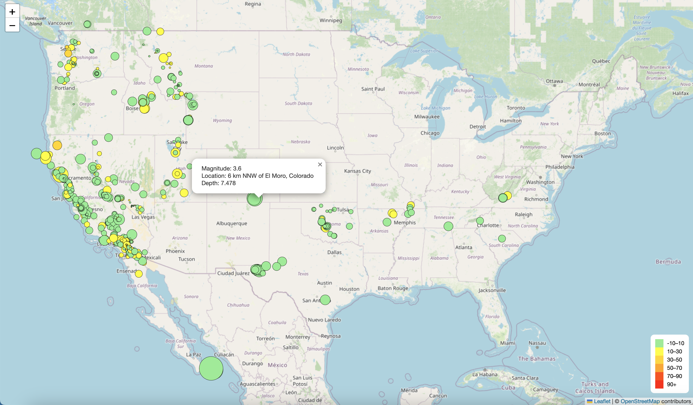

# Leaflet-Challenge

+ Part 1: Create the Earthquake Visualization
+ Part 2: Gather and Plot More Data (Optional with no extra points earning)

## Getting Started
### prerequisites
+ D3
+ Leaflet
+ geoJSON

 
Created a map using Leaflet that plots all the earthquake data from USGS data based on their longitude and latitude. Included popus that provide additional info about the earthquake when its associated marker is clicked. Created a legend that provides context for map data.

 
Ploted the tectonic plates dataset on the map in addition to the earthquakes.
Added other base maps to choose from.
Put each dataset into separate overlays that can be turned on and off independently.
Added layer controls to map.
